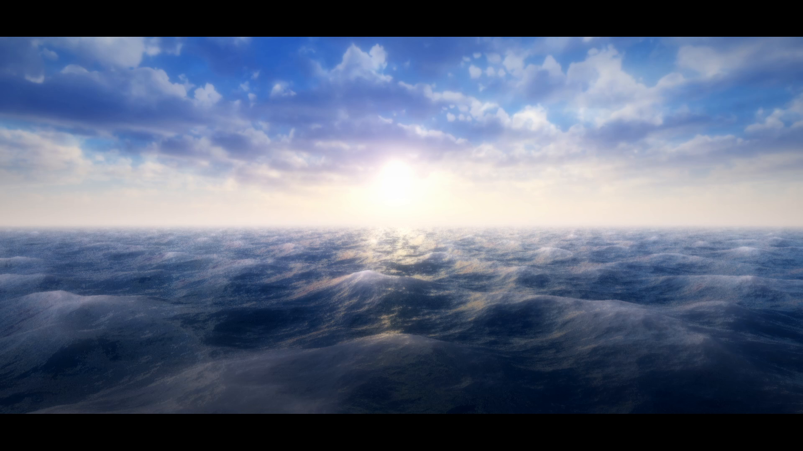
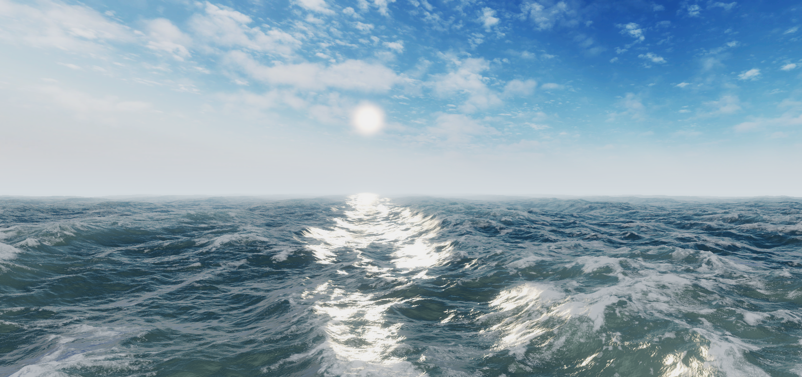

# Water Rendering

by Garrett Gunnell

This repo contains the code associated with my [videos](https://www.youtube.com/playlist?list=PLUKV95Q13e_XT0hJCbvLdJxTRLjCIR_WR) on the same subject.

## Features

* Sum Of Sines Fluid Simulation (from GPU Gems)
* * Sine Wave
* * Exponential Sine Wave
* * Gerstner Wave
* FBM Fluid Simulation
* * Euler Wave (idk that's what I'm calling it)
* Analytical Normals For Both
* Basic Atmosphere Shader
* * Distance Fog w/ Height Attenuation
* * Sun
* * Simple Skybox Animation
* Basic "PBR" Water Shader
* * Blinn Phong
* * Fresnel Reflectance
* * Optional Cubemap Reflections
* Fast Fourier Transform Fluid Simulation (Tessendorf)
* * Dual JONSWAP (4 layered frequency bands)
* An Actual PBR Water Shader
* * Microfacet BRDF
* * * Beckmann Distribution
* * Approximate subsurface scattering

These shaders aren't optimized (there is a lot of trash left around for demo purposes) or intended to be used as a production ready asset. Please use as a reference for your own shaders.

## What's Missing?

* Buoyancy
* Wakes and other water interactions

Will do someday!

## Examples

### Sum Of Sines

This method is really cheap and is ideal for small bodies of water like ponds or maybe lakes, it is not ideal for large bodies of water like oceans because it tiles very quickly.

### Fast Fourier Transform

This method is the big daddy of the simple sum of sines and uses oceanographic spectrums to generate a frequency domain ocean height map which we then convert to the time domain with the inverse fast fourier transform, effectively summing millions of waves instead of just a few like the simple sum of sines. This is obviously overkill for small bodies of water, but necessary for large bodies to have a realistic water surface with basically no tiling.

## References

https://developer.nvidia.com/gpugems/gpugems/part-i-natural-effects/chapter-1-effective-water-simulation-physical-models

https://iquilezles.org/articles/fbm/

https://www.shadertoy.com/view/MdXyzX

http://filmicworlds.com/blog/everything-has-fresnel/

https://boksajak.github.io/files/CrashCourseBRDF.pdf

https://people.computing.clemson.edu/~jtessen/reports/papers_files/coursenotes2004.pdf

https://www.keithlantz.net/2011/11/ocean-simulation-part-two-using-the-fast-fourier-transform/

https://gpuopen.com/gdc-presentations/2019/gdc-2019-agtd6-interactive-water-simulation-in-atlas.pdf

https://wikiwaves.org/Ocean-Wave_Spectra

https://github.com/iamyoukou/fftWater

https://www.slideshare.net/Codemotion/an-introduction-to-realistic-ocean-rendering-through-fft-fabio-suriano-codemotion-rome-2017